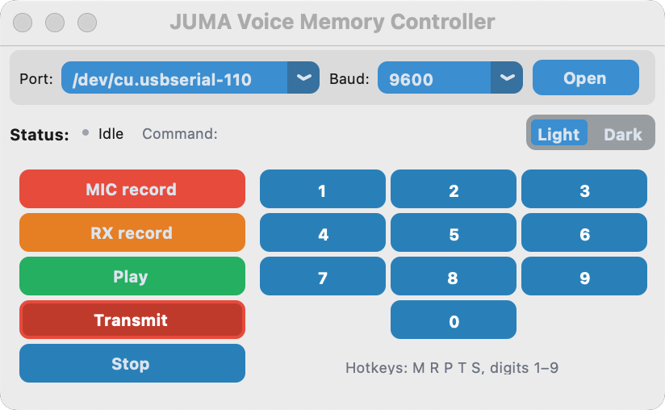
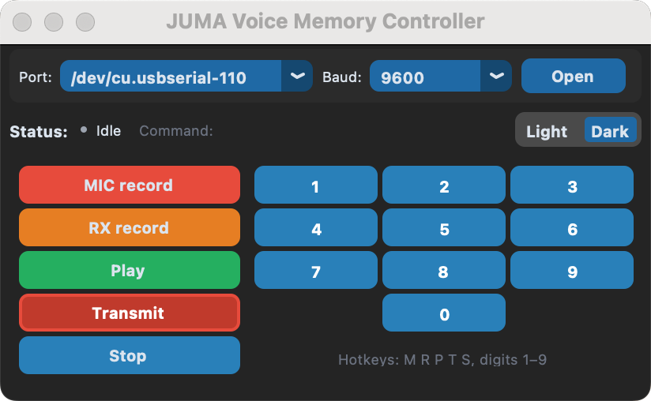

# JUMA Voice Memory Controller

**Version:** 1.0.0  
**Developer:** extrememan-fin OH2DDG  
**Technical assistance:** OH7SV  

---

## 🗒 Overview

**JUMA Voice Memory Controller** is a cross-platform graphical controller for JUMA transceivers.  
It communicates via RS-232 and provides a clear, compact **CustomTkinter** interface for controlling the radio’s voice-memory functions.

---

## ⚙️ Features

- RS-232 control for JUMA radios  
- MIC Record / RX Record / Play / Transmit / Stop functions  
- Numeric memory keys (0–9)  
- Live command feedback and status indicator  
- Light / Dark theme toggle with memory  
- Compact, aligned layout with color-coded buttons  
- Cross-platform support: macOS  |  Windows  |  Linux

---

## 🧩 Requirements

| Package | Purpose |
|----------|----------|
| `customtkinter` | Modern Tkinter-based UI |
| `pyserial` | Serial-port communication |
| `darkdetect` | Detects system theme |
| `python` ≥ 3.9 | Interpreter |

Install dependencies:

```bash
pip install customtkinter pyserial darkdetect
```

---

## ▶️ Running from Source

```bash
python juma_voice_memory_controller.py
```

If you see a message such as  
`ModuleNotFoundError: No module named 'serial'`, install pyserial:

```bash
pip install pyserial
```

---

## 💾 Packaging (macOS Example)

```bash
pyinstaller --noconfirm --windowed   --name "JUMA Voice Memory Controller"   --icon "icon.icns"   --hidden-import serial   --hidden-import serial.tools.list_ports   --collect-submodules serial   juma_voice_memory_controller.py
```

Result:
```
dist/JUMA Voice Memory Controller.app
```

---

## 💿 Creating a DMG Installer

```bash
rm -rf dmg_src
mkdir dmg_src
cp -R "dist/JUMA Voice Memory Controller.app" dmg_src/

create-dmg   --volname "JUMA Voice Memory Controller"   --window-pos 300 200   --window-size 480 240   --icon-size 100   --icon "JUMA Voice Memory Controller.app" 120 120   --app-drop-link 360 120   "JUMA_Voice_Memory_Controller_v1_0_0.dmg"   "dmg_src/"
```

When opened, the installer shows  
**JUMA Voice Memory Controller.app** on the left and the **Applications** folder on the right.

---

## 🪟 Windows Build (.exe)

```bash
pyinstaller --noconfirm --windowed --onefile   --name "JUMA Voice Memory Controller"   --icon "icon.ico"   --hidden-import serial   --hidden-import serial.tools.list_ports   --collect-submodules serial   juma_voice_memory_controller.py
```

Result:
```
dist/JUMA Voice Memory Controller.exe
```

---

## 🗂 Folder Structure

```
JUMA_Voice_Memory_Controller/
│
├── juma_voice_memory_controller.py
├── icon.icns / icon.ico
├── README.md
│
├── dist/      # Build output
├── build/     # Temporary build files
└── dmg_src/   # DMG source folder
```

---

## ⚠️ macOS Gatekeeper

If the app does not open, run once:

```bash
xattr -dr com.apple.quarantine "JUMA Voice Memory Controller.app"
```

---

## 📸 Screenshots

### macOS


---
## 🏁 Credits

**Developed by:** extrememan-fin OH2DDG  
**Assistance by:** OH7SV  

All programming, interface design, and testing by ** extrememan-fin OH2DDG**.  
Free for personal and experimental use.

---
